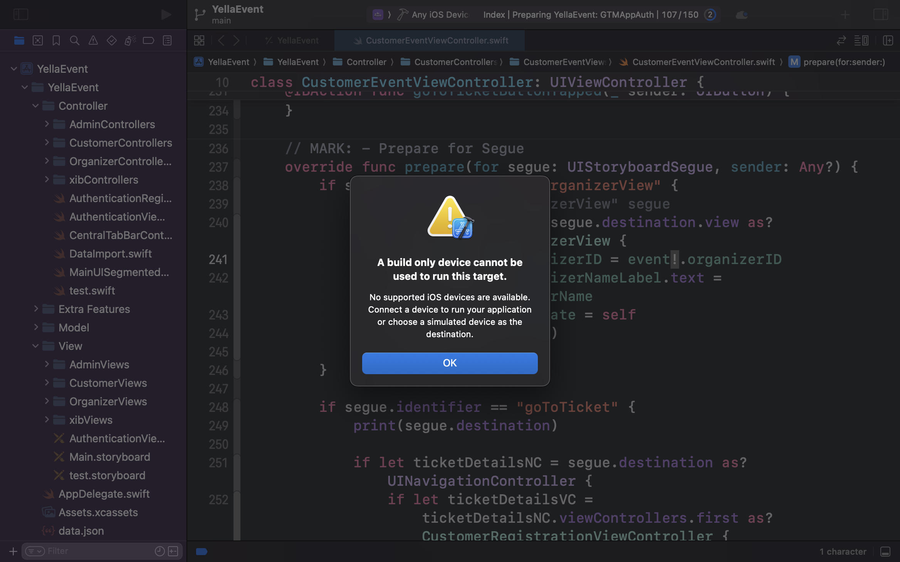

# <h1 style="text-align:center"><pur>Yalla Event</h1>

Yalla Event is an all-in-one platform designed to streamline the discovery, booking, and organization of events. Leveraging Firebase for secure data storage and real-time updates, the app offers personalized event recommendations, user profiles, seamless ticketing, and more.

## Table of Contents

&nbsp;&nbsp;&nbsp;&nbsp;[Features](#features) 
&nbsp;&nbsp;&nbsp;&nbsp;[Design Changes](#design-changes) 
&nbsp;&nbsp;&nbsp;&nbsp;[Compatibility](#compatibility) 
&nbsp;&nbsp;&nbsp;&nbsp;[Setup Instructions](#setup-instructions) 
&nbsp;&nbsp;&nbsp;&nbsp;[Possible Issues](#possible-issues) 
&nbsp;&nbsp;&nbsp;&nbsp;[Login Credentials](#login-credentials) 
&nbsp;&nbsp;&nbsp;&nbsp;[Used Libraries](#used-libraries) 
&nbsp;&nbsp;&nbsp;&nbsp;[Contributors](#contributors) 
&nbsp;&nbsp;&nbsp;&nbsp;[License](#license) 

## Features

### Husain Sabba (Developer) & Ahmed Ali (Tester)
- **Search, Filtering, and Browsing**: Advanced search and filtering options to find events tailored to your interests.
- **Leaderboard and Badges**: Earn badges for attending events and climb the leaderboard to unlock discounts.
- **QR code**: Generate and manage QR codes for event tickets. **EXTRA**

### Fatima Hasan (Developer) & Dalal Tarrda (Tester)
- **Users’ Profiles**: Showcase your preferences, reviews, and photos.
- **User Management**: Oversee user accounts and manage them effectively.
- **FAQ Section**: Access frequently asked questions for assistance. **EXTRA**

### Ahmed Ali (Developer) & Maryam Ali (Tester)
- **Authentication**: Handles user authentication, enabling sign-up, login, and password resets.
- **Content Management**: Manage app categories with ease.
- **Real-Time Notifications**: Stay updated with the latest event information. **EXTRA**

### Alanood Alkhateeb (Developer) & Fatima Hasan (Tester)
- **Seamless Registration**: Register for events, make secure payments, and access digital tickets with QR codes.
- **Rating System**: Allows users to provide feedback on events.
- **Ticket Cancellation**: Cancel tickets with ease when necessary. **EXTRA**

### Dalal Tarrda (Developer) & Husain Sabba (Tester)
- **View Event Details**: Access detailed information about events as well as view live events hosted by organizers.
- **Event Management**: Manage events and track performance analytics to moderate app content.
- **Integration with Maps**: Displays event locations on an interactive map. **EXTRA**

### Maryam Ali (Developer) & Alanood Alkhateeb (Tester)
- **Dynamic Content Personalization**: Offers personalized recommendations based on your preferences, interactions and ratings.
- **Statistics**: Provides performance insights in app and event data for both the admin and organizer.
- **Google Signup**: Allows users to sign in using Google accounts. **EXTRA**

## Design Changes

- **Ahmed**:
  - Removed OTP Code Screen & Change Password Screen.
  - Removed "Demo Purpose [Organizer & Admin]" button on the login screen.
- **Fatima**:
  - In the user profile, changed the password field to a "Change Password" link that sends a reset password email.
  - Disabled editing for all email fields.
- **Husain**:
  - Added a reset filter in the filter page.
  - Removed the dropdown from the badges page as it was unnecessary.
- **Dalal**:
  - Removed "Manage Media"; now only one image per cover is allowed.
  - Changed the ban event page for admin to display an alert instead.
- **Alanood**:
  - Modified ratings to be an alert rather than navigating to a different page.
- **Maryam**:
  - Added FAQ stats to the admin page.

## Compatibility

The app is compatible with both iPads and iPhones. It has been tested on multiple screen sizes to ensure seamless integration with various iOS devices.

- **iPad Air 11-inch (M2)**: Main testing device for iPad compatibility.
- **iPhone 16 Pro**: Main testing device for iPhone compatibility.

Both devices are running on iOS 18.0.

## Setup Instructions

1. **Clone the Repository**:
   - Open Xcode and select "Clone Git Repository…".  
   
   - Enter the repository URL: [`https://github.com/memezsxz/YellaEvent.git`](https://github.com/memezsxz/YellaEvent.git).
     
   - Select the "main" branch and choose a local directory to save the project.
     

2. **Open the Project**:
   - Xcode will automatically open the cloned project.

3. **Run the App**:
   - Click the run button in Xcode.
   - Wait for the simulator to launch and deploy the app.

## Possible Issues

### Build-Only Device Error:
   - **Description**: Encountering the error message "A build-only device cannot be used to run this target" when attempting to run the app.
       
   - **Solution**:
     1. Click "OK" on the error message.
     2. Navigate to the device selection menu in Xcode.
     3. Ensure that a valid simulator or physical device is selected instead of a build-only device.
        
     4. Attempt to run the app again.

### Packages Are Missing:
   - **Description**: The app fails to build due to missing package dependencies.
       
   - **Solution**:
     1. From the top Xcode menu, select "File".
     2. Hover over the "Packages" option until its sub-options are displayed.
     3. Click on "Resolve Package Versions".
         

     4. Wait for Xcode to finish resolving the packages, then run the app again.

## Login Credentials

- **Customer**:
  - Email: [liam.miller@gmail.com](mailto:liam.miller@gmail.com)
  - Password: 123456
- **Organizer**:
  - Email: [info@tamkeen.bh](mailto:info@tamkeen.bh)
  - Password: 123456
- **Admin**:
  - Email: [alice.johnson@company.com](mailto:alice.johnson@company.com)
  - Password: 123456

## Used Libraries

This project utilizes several libraries to provide enhanced functionality and support:

### [Firebase](https://firebase.google.com/docs/) - Retrieved from [Firebase iOS SDK](https://github.com/firebase/firebase-ios-sdk).

- **FirebaseCore**
    - This library is used to set up and initialize Firebase services in your app. It connects the app to Firebase and enables features like analytics, push notifications, and cloud functions to work correctly.

- **FirebaseFirestore**
    - FirebaseFirestore is a cloud-based database that helps store and manage your app's data. It offers real-time updates, meaning your app's data syncs automatically across devices.

- **FirebaseAuth**
    - FirebaseAuth is used to handle user authentication. It makes it easy to allow users to sign up, log in, and reset passwords.

- **Firebase Storage**
    - Firebase Storage provides a robust, secure, and scalable solution to store user-generated content, such as photos and videos, and manage file uploads and downloads.

### [GoogleSignIn-iOS](https://developers.google.com/identity/sign-in/ios) - Retrieved from [GoogleSignIn-iOS](https://github.com/google/GoogleSignIn-iOS).

- **Google Sign-In**
    - Google Sign-In allows users to authenticate with your app using their Google account, making it easier and faster for users to sign in.

## Contributors

- **Husain Sabba** – 202200408
- **Fatima Hasan** – 202200903
- **Ahmed Ali** – 202203193
- **Alanood Alkhateeb** – 202200053
- **Dalal Tarrda** – 202201271
- **Maryam Ali** – 202200403

Professor: **Ghassan AlShajjar**

## License

This project is licensed under the GNU General Public License v3.0 License.
